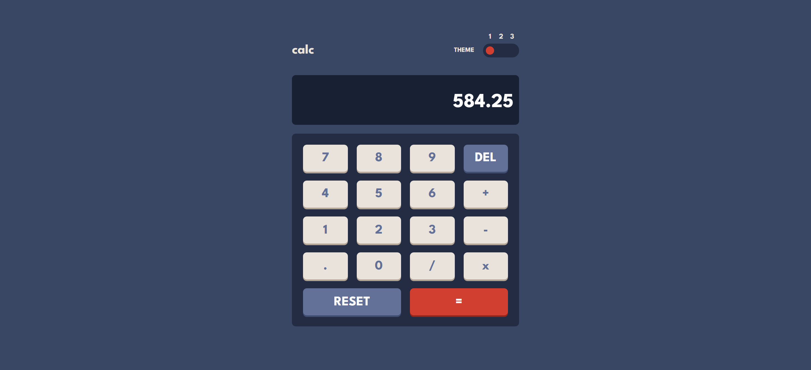

# Frontend Mentor - Calculator app solution

This is a solution to
the [Calculator app challenge on Frontend Mentor](https://www.frontendmentor.io/challenges/calculator-app-9lteq5N29).
Frontend Mentor challenges help you improve your coding skills by building realistic projects.

## Table of contents

- [Overview](#overview)
  - [The challenge](#the-challenge)
  - [Screenshot](#screenshot)
  - [Links](#links)
- [My process](#my-process)
  - [Built with](#built-with)
  - [What I learned](#what-i-learned)
  - [Continued development](#continued-development)
  - [Useful resources](#useful-resources)
- [Author](#author)

**Note: Delete this note and update the table of contents based on what sections you keep.**

## Overview

### The challenge

Users should be able to:

- See the size of the elements adjust based on their device's screen size
- Perform mathematical operations like addition, subtraction, multiplication, and division
- Adjust the color theme based on their preference
- **Bonus**: Have their initial theme preference checked using `prefers-color-scheme` and have any additional changes
  saved in the browser

### Screenshot

The screenshots below showcase the appearance of the website in both desktop and mobile view:

### Desktop view screenshots:




### Mobile view screenshots:


### Links

- Solution URL: [Project solution URL](https://github.com/LorryAfriyie/calculator-app)
- Live Site URL: [Live site URL](https://your-live-site-url.com)

## My process

### Built with

- CSS custom properties
- SCSS
- Flexbox
- CSS Grid
- Mobile-first workflow
- TypeScript
- [React](https://reactjs.org/) - JS library
- [Vite.js](https://vitejs.dev/) - Frontend Tooling

### What I learned

Use regex to be able to add a comma by the thousand mark in a numeric value:

```js
const toLocaleString = (value?: string | number) =>
  String(value).replace(/\B(?=(\d{3})+(?!\d))/g, ",");
```

Use regex to be able to remove a comma from a numeric value:

```js
  const removeSpaces = (value?: string | number) =>
    value!.toString().replace(/,/g, "");
```

### Continued development

- Continue learning and utilizing TypeScript on React.js with Vite.js

### Useful resources

- [Tristate toggle switch](https://dev.to/sanaz/tristate-toggle-switch-509n) - This helped me create a tristate toggle
  switch.
- [Removing a item/value from an array](https://www.geeksforgeeks.org/how-to-delete-an-item-from-state-array-in-reactjs/) -
  This article explained how to remove an item/value from an array with react.js.
- [Array.reduce method](https://developer.mozilla.org/en-US/docs/Web/JavaScript/Reference/Global_Objects/Array/reduce) -
  This article
  details the use of the array.reduce method that helped me concatenate the numerical values inside an array.
- [Type casting on TypeScript](https://blog.logrocket.com/how-to-perform-type-casting-typescript/) - This post goes in
  depth with how type casting works on TypeScript and which type of
  casting should be used based on requirement.
- [Calculator App with React.js](https://www.sitepoint.com/react-tutorial-build-calculator-app/) - This blog post is a
  reference to how to create a calculator application using react.js
- [Value checking using TypeScript](https://www.webdevtutor.net/blog/typescript-check-if-it-is-number) - This post
  details how to check if value is of type number in TypeScript.
- [Storing multiple elements in a single ref](https://www.seancdavis.com/posts/storing-multiple-elements-in-a-single-ref-in-react/) -
  This article demonstrates how to store multiple HTML elements into a single useRef.
- [Fix Maximum Update Depth Exceeded](https://typeofnan.dev/fix-the-maximum-update-depth-exceeded-error-in-react/) -
  This posts explains different ways to resolve an infinite loop on in React.js.

## Author

- Frontend Mentor - [@LorryAfriyie](https://www.frontendmentor.io/profile/LorryAfriyie)

---
